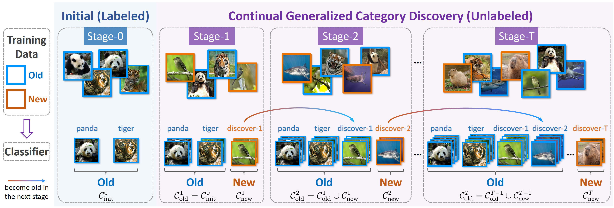
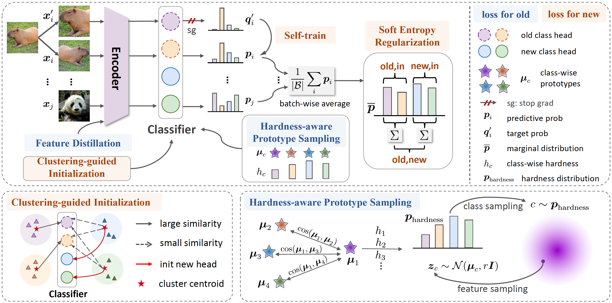

# Happy: A Debiased Learning Framework for Continual Generalized Category Discovery

Official implementation of our paper: **Happy: A Debiased Learning Framework for Continual Generalized Category Discovery [NeurIPS 2024]**

We study the under-explored setting of C-GCD as follows:

We introduce our method: **Happy**, which is characterized by <ins>H</ins>ardness-<ins>a</ins>ware <ins>p</ins>rototype sampling and soft entro<ins>py</ins> regularization, as follows:

## Running :running:

Codes will be released soon.

## Acknowledgements :gift:

In building the AGCD codebase, we reference [SimGCD](https://github.com/CVMI-Lab/SimGCD).

## License :white_check_mark:

This project is licensed under the MIT License - see the [LICENSE](https://github.com/mashijie1028/ActiveGCD/blob/main/LICENSE) file for details.

## Contact :email:

If you have further questions or discussions, feel free to contact me:

Shijie Ma (mashijie2021@ia.ac.cn)
